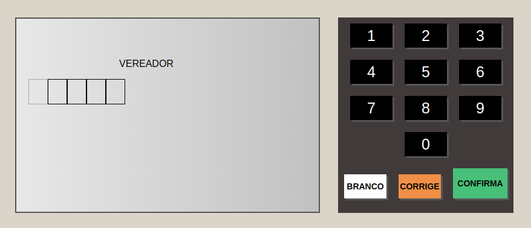
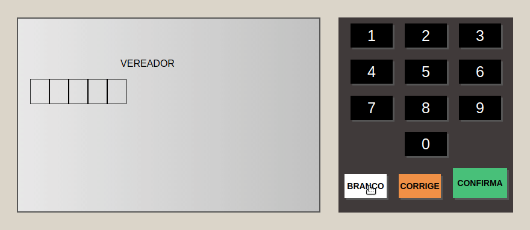

  

<h3 align="center">
  Simulação de Urna eletrônica feito com HTML, CSS e Javascript
</h3>

<blockquote align="center">“Ama-se mais o que se conquista com esforço"

Benjamin Disraeli
    </blockquote>

  <a href="#features-adicionadas">Features</a>&nbsp;&nbsp;&nbsp;|&nbsp;&nbsp;&nbsp;
  <a href="#features-adicionadas">Como funciona</a>&nbsp;&nbsp;&nbsp;

## Features adicionadas

- [X] Botôes para seleção dos candidatos
- [X] Seleção de vereadores
- [X] Seleção de prefeitos
- [X] Opção de voto em branco 
- [X] Opção de anular o voto (Quando é digitado um voto não válido)
- [X] Opção de corrigir o voto

## Como funciona

---

by Eliel Silva
